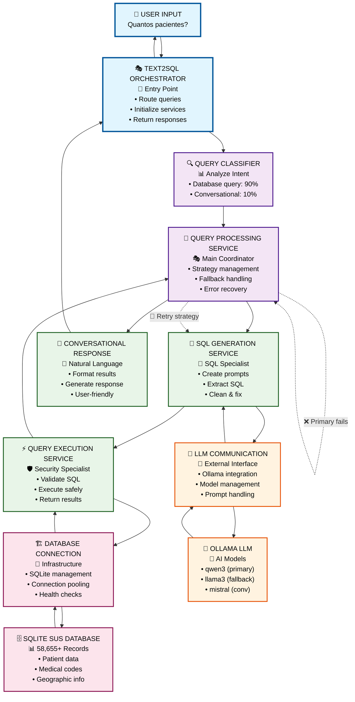
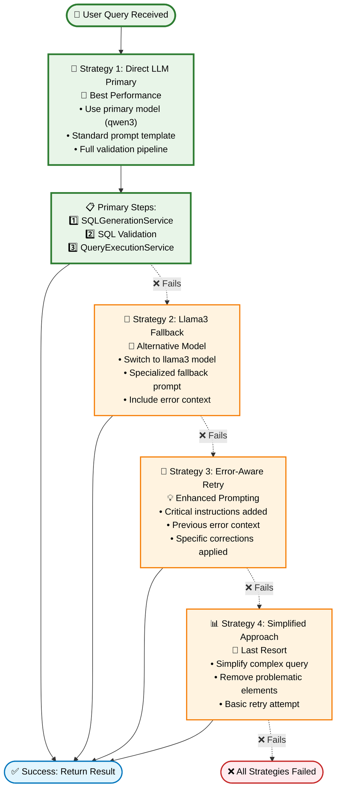
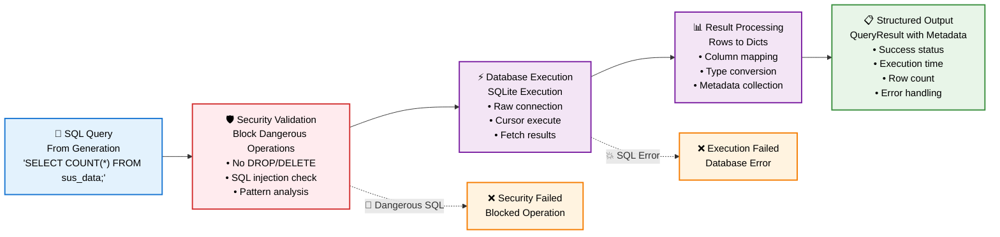
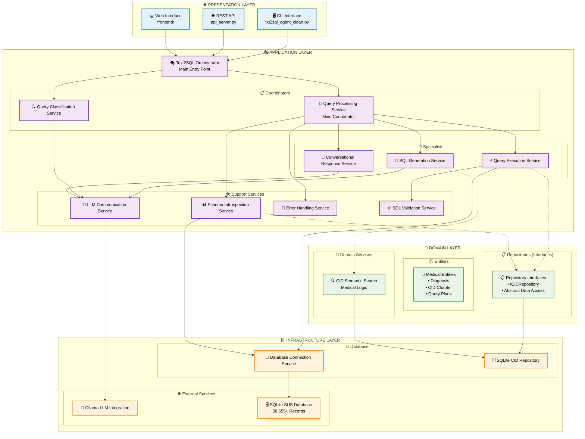

# 🏗️ Fluxo Arquitetural Completo - TXT2SQL System

## 🌊 **Fluxo Completo de Execução**



## 📋 **Detalhamento por Camada**

### 🎯 **1. Text2SQL Orchestrator (Entry Point)**
**Localização:** `src/application/orchestrator/text2sql_orchestrator.py`

**Função:**
- 📥 Recebe input do usuário (CLI/API)
- 🔄 Inicializa todos os serviços
- 🎭 Classifica tipo de query (database vs conversational)
- 📊 Delega para QueryProcessingService
- 📤 Retorna resposta formatada

### 🎯 **2. Query Processing Service (Coordenador Principal)**
**Localização:** `src/application/services/query_processing_service.py`

**Estratégias de Processamento:**



### 🔧 **3. SQL Generation Service (Especialista)**
**Localização:** `src/application/services/sql_generation_service.py`

**Pipeline de Geração:**

```mermaid
graph LR
    Input["🗣️ User Query<br/>Natural Language<br/>'Quantos pacientes?'"]
    
    Prompt["🎨 Create Prompt<br/>Domain Expert<br/>• SUS context<br/>• Medical terms<br/>• SQL patterns"]
    
    LLM["🤖 Call LLM<br/>AI Model<br/>• qwen3/llama3<br/>• Specialized prompt<br/>• Generate response"]
    
    Extract["🔍 Extract SQL<br/>Regex Parse<br/>• Multiple patterns<br/>• Markdown cleanup<br/>• Multi-line support"]
    
    Clean["🧹 Clean & Fix<br/>Rules Apply<br/>• Remove comments<br/>• Fix case sensitivity<br/>• SQLite compatibility"]
    
    Output["✅ Valid SQL<br/>SQLite Ready<br/>'SELECT COUNT(*) FROM sus_data;'"]
    
    Input --> Prompt
    Prompt --> LLM
    LLM --> Extract
    Extract --> Clean
    Clean --> Output
    
    %% Styling
    classDef input fill:#e3f2fd,stroke:#1976d2,stroke-width:2px,color:#000000
    classDef process fill:#f3e5f5,stroke:#7b1fa2,stroke-width:2px,color:#000000
    classDef output fill:#e8f5e8,stroke:#388e3c,stroke-width:2px,color:#000000
    
    class Input input
    class Prompt,LLM,Extract,Clean process
    class Output output
```



**Especializações:**
- 🎨 **Prompts SUS-específicos**: Contexto médico brasileiro
- 🔍 **Extração robusta**: Múltiplos padrões regex para SQL
- 🧹 **Limpeza inteligente**: Remove comentários problemáticos
- 🔧 **Correções SQLite**: YEAR() → strftime(), case sensitivity

### ⚡ **4. Query Execution Service (Especialista)**
**Localização:** `src/application/services/query_execution_service.py`

**Pipeline de Execução Segura:**



**Validações de Segurança:**
- 🚨 **SQL Injection**: Bloqueia palavras perigosas (DROP, DELETE, etc.)
- 🚨 **Date Arithmetic**: Força uso de JULIANDAY para cálculos
- 🚨 **Pattern Detection**: Detecta comentários suspeitos
- 🚨 **SELECT Only**: Permite apenas operações de leitura

### 🏗️ **5. Database Connection Service (Infrastructure)**
**Localização:** `src/infrastructure/database/connection_service.py`

**Tipos de Conexão:**
- 🔌 **LangChain SQLDatabase**: Para operations de alto nível
- ⚡ **Raw SQLite**: Para execução direta e performance
- 🧪 **Test Connections**: Para health checks isolados

## 🔄 **Exemplo de Execução Completa**

### **Input:** "Quantos pacientes existem?"

```mermaid
sequenceDiagram
    participant User as 👤 User
    participant Orch as 🎭 Orchestrator
    participant Class as 🔍 Classifier
    participant Proc as 🎯 QueryProcessor
    participant Gen as 🔧 SQLGenerator
    participant LLM as 🤖 LLM Service
    participant Exec as ⚡ QueryExecutor
    participant DB as 🗄️ Database
    participant Conv as 💬 Conversational

    User->>Orch: "Quantos pacientes existem?"
    
    Orch->>Class: Classify query type
    Class-->>Orch: "database_query" (90% confidence)
    
    Orch->>Proc: process_query(request)
    
    Note over Proc: Strategy: Direct LLM Primary
    
    Proc->>Gen: generate_sql_query(user_query)
    Gen->>LLM: send_prompt(specialized_prompt)
    LLM-->>Gen: SQL response
    Gen-->>Proc: "SELECT COUNT(*) FROM sus_data;"
    
    Proc->>Exec: execute_sql_query(sql)
    
    Note over Exec: Security validation ✅
    
    Exec->>DB: Execute query
    DB-->>Exec: Raw results: [(58655,)]
    Exec-->>Proc: QueryResult(success=True, results=[{"COUNT(*)": 58655}])
    
    Proc->>Conv: format_response(results)
    Conv-->>Proc: "Foram registrados 58.655 pacientes no SUS."
    
    Proc-->>Orch: Final response
    Orch-->>User: "Foram registrados 58.655 pacientes no SUS."
    
    Note over User,Conv: ✅ Total time: ~22 seconds
```

### **Detalhamento por Etapa:**

1. **🎭 Orchestrator**: Recebe query e inicializa workflow
2. **🔍 Classifier**: Identifica como "database_query" (90% confiança) 
3. **🎯 QueryProcessor**: Escolhe estratégia "Direct LLM Primary"
4. **🔧 SQLGenerator**: Cria prompt SUS-específico → chama LLM → extrai/limpa SQL
5. **⚡ QueryExecutor**: Valida segurança → executa no SQLite → processa resultados
6. **💬 Conversational**: Formata resposta em linguagem natural
7. **👤 User**: Recebe resposta final formatada

## 📊 **Métricas de Performance**

| Componente | Tempo Típico | Responsabilidade |
|------------|--------------|------------------|
| **Text2SQL Orchestrator** | ~0.1s | Inicialização e roteamento |
| **Query Classification** | ~0.5s | Análise de tipo de query |
| **SQL Generation** | ~10-15s | LLM call + processamento |
| **SQL Validation** | ~0.1s | Verificações de segurança |
| **Query Execution** | ~0.1s | Execução no SQLite |
| **Response Generation** | ~5-8s | LLM conversational call |
| **TOTAL** | ~16-24s | Pipeline completo |

## 🏗️ **Visão Arquitetural por Camadas**



## 🛡️ **Pontos de Segurança**

1. **SQL Injection Prevention** - QueryExecutionService
2. **Dangerous Operations Blocking** - Multiple validation layers  
3. **Data Leak Prevention** - Read-only operations only
4. **Input Sanitization** - SQL cleaning and validation
5. **Error Information Filtering** - Controlled error messages

## 🎯 **Benefícios da Arquitetura Modular**

1. **🧪 Testabilidade**: Cada serviço pode ser testado isoladamente
2. **🔧 Manutenibilidade**: Bug fixes limitados ao serviço específico
3. **📈 Escalabilidade**: Serviços podem ser otimizados independentemente
4. **🔄 Flexibilidade**: Fácil adição de novas estratégias ou validações
5. **📊 Observabilidade**: Métricas granulares por componente
6. **🛡️ Robustez**: Falha de um componente não quebra o sistema todo

## 📊 **Fluxo de Dados Detalhado**

```mermaid
flowchart TD
    subgraph "📥 INPUT LAYER"
        UserInput["👤 User Input<br/>'Quantos pacientes existem?'<br/>🔤 Natural Language"]
    end
    
    subgraph "🔄 PROCESSING PIPELINE"
        Request["📋 QueryRequest<br/>• user_query: string<br/>• session_id: optional<br/>• timestamp: datetime<br/>• context: dict"]
        
        Classification["🔍 Classification Result<br/>• type: 'database_query'<br/>• confidence: 0.90<br/>• reasoning: patterns"]
        
        SQLRaw["🤖 Raw LLM Response<br/>• model_output: text<br/>• length: ~1800 chars<br/>• format: mixed"]
        
        SQLClean["🔧 Clean SQL<br/>• query: 'SELECT COUNT(*) FROM sus_data;'<br/>• validated: true<br/>• safe: true"]
        
        DBResult["🗄️ Database Result<br/>• raw: [(58655,)]<br/>• columns: ['COUNT(*)']<br/>• rows: 1"]
        
        Structured["📊 Structured Result<br/>• results: [{\"COUNT(*)\": 58655}]<br/>• success: true<br/>• execution_time: 0.1s<br/>• row_count: 1"]
    end
    
    subgraph "📤 OUTPUT LAYER"
        NaturalResponse["💬 Natural Response<br/>'Foram registrados 58.655 pacientes no SUS.'<br/>🗣️ User-Friendly"]
        
        APIResponse["🌐 API Response<br/>• question: string<br/>• sql_query: string<br/>• results: array<br/>• metadata: object<br/>• timestamp: datetime"]
    end
    
    %% Data Flow
    UserInput --> Request
    Request --> Classification
    Classification --> SQLRaw
    SQLRaw --> SQLClean
    SQLClean --> DBResult
    DBResult --> Structured
    Structured --> NaturalResponse
    Structured --> APIResponse
    
    %% Data Transformations
    Request -.->|"🎨 Prompt Engineering"| SQLRaw
    SQLRaw -.->|"🧹 Cleaning & Validation"| SQLClean
    DBResult -.->|"📋 Row to Dict Conversion"| Structured
    Structured -.->|"💬 LLM Conversational"| NaturalResponse
    
    %% Styling
    classDef input fill:#e3f2fd,stroke:#1976d2,stroke-width:2px,color:#000000
    classDef process fill:#f3e5f5,stroke:#7b1fa2,stroke-width:2px,color:#000000
    classDef output fill:#e8f5e8,stroke:#388e3c,stroke-width:2px,color:#000000
    
    class UserInput input
    class Request,Classification,SQLRaw,SQLClean,DBResult,Structured process
    class NaturalResponse,APIResponse output
```

## 🔄 **Estados dos Dados por Etapa**

| Etapa | Formato | Exemplo | Responsável |
|-------|---------|---------|-------------|
| **Input** | Natural Language | "Quantos pacientes existem?" | User Interface |
| **Request** | QueryRequest Object | `{user_query: str, session_id: str, ...}` | Orchestrator |
| **Classification** | Classification Result | `{type: "database_query", confidence: 0.90}` | Query Classifier |
| **LLM Response** | Raw Text | Mixed format with SQL embedded | LLM Service |
| **Clean SQL** | SQL String | `"SELECT COUNT(*) FROM sus_data;"` | SQL Generator |
| **DB Result** | Raw Tuples | `[(58655,)]` | Database |
| **Structured** | QueryResult | `{results: [{"COUNT(*)": 58655}], success: true}` | Query Executor |
| **Natural** | User Response | "Foram registrados 58.655 pacientes no SUS." | Conversational Service |
| **API** | JSON Response | Complete API response object | API Layer |

---

**🏆 Resultado:** Arquitetura limpa, maintível e robusta que preserva 100% da funcionalidade original com melhor organização, extensibilidade e **visualização completa através de diagramas Mermaid interativos**.