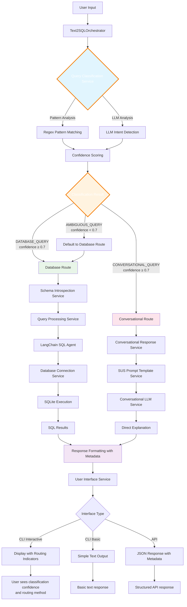

# CLAUDE.md

This file provides guidance to Claude Code (claude.ai/code) when working with code in this repository.

## Commands

### Main Application
- **Run the main TXT2SQL agent**: `python txt2sql_agent_clean.py`
- **Run with basic interface**: `python txt2sql_agent_clean.py --basic`
- **Single query execution**: `python txt2sql_agent_clean.py --query "Your question here"`
- **Health check**: `python txt2sql_agent_clean.py --health-check`
- **Architecture info**: `python txt2sql_agent_clean.py --version`

### Database Setup
- **Initialize database**: `python database_setup.py`

### API Server
- **Start FastAPI server**: `python api_server.py`
- **Alternative simple API**: `python simple_api.py`

### Frontend
- **Start Node.js frontend** (from frontend/ directory): `npm start`
- **Development mode**: `npm run dev`

### Testing
- **Run API tests**: `python tests/test_api.py`
- **Comprehensive API tests**: `python tests/comprehensive_api_tests.py`
- **Clean architecture tests**: `python tests/test_clean_arch.py`
- **CID integration tests**: `python test_cid_integration.py`
- **Query routing integration tests**: `python test_routing_integration.py`

### Dependencies
- **Install Python dependencies**: `pip install -r requirements.txt`
- **Install Node.js dependencies** (in frontend/): `npm install`

## Architecture Overview

This is a clean architecture TXT2SQL system for Brazilian SUS (healthcare) data that follows SOLID principles.

### Core Components

**Main Entry Points:**
- `txt2sql_agent_clean.py` - Primary CLI interface with multiple modes
- `api_server.py` - FastAPI REST API server
- `frontend/` - Node.js Express web interface

**Clean Architecture Layers:**

1. **Application Layer** (`src/application/`)
   - `orchestrator/text2sql_orchestrator.py` - Main coordinator with intelligent query routing
   - `container/dependency_injection.py` - DI container managing service dependencies
   - `services/` - 10 specialized services following Single Responsibility Principle:
     - `database_connection_service.py` - Database connection management with SQLite/LangChain integration
     - `llm_communication_service.py` - LLM communication (Ollama/local models) with retry logic
     - `schema_introspection_service.py` - Database schema analysis and context generation
     - `user_interface_service.py` - CLI/API interface handling with routing indicators
     - `error_handling_service.py` - Centralized error management with categorization
     - `query_processing_service.py` - SQL query processing using LangChain SQL Agent
     - `query_classification_service.py` - **NEW**: Intelligent query type classification
     - `conversational_response_service.py` - Multi-LLM conversational response generation
     - `conversational_llm_service.py` - Specialized conversational LLM service
     - `sus_prompt_template_service.py` - SUS domain-specific prompt templates with direct conversational support

2. **Domain Layer** (`src/domain/`)
   - `entities/` - Core business entities (patient, diagnosis, procedure, query_result)
   - `value_objects/` - Immutable value objects (diagnosis_code, municipality_code, patient_age)
   - `services/` - Domain services (CID semantic search)
   - `repositories/` - Repository interfaces
   - `exceptions/` - Custom domain exceptions

3. **Infrastructure Layer** (`src/infrastructure/`)
   - `repositories/` - Concrete repository implementations (SQLite CID repository)

### Key Design Patterns

- **Dependency Injection**: All services are injected through the DI container
- **Repository Pattern**: Database access abstracted through repository interfaces
- **Service Layer**: Business logic encapsulated in specialized services
- **Factory Pattern**: Service creation managed by factories

### Data Sources

- **Primary Database**: `sus_database.db` (SQLite) - 24,485 SUS patient records
- **CID-10 Data**: `data/cid10*.csv` files for diagnosis code lookup
- **Additional Data**: Various CSV files in `data/` directory for healthcare categories

### Intelligent Query Routing System 🎯

**NEW FEATURE**: The system now intelligently routes queries based on their intent:

- **Query Classification**: Automatic detection of query type using pattern matching + LLM analysis
- **Query Types**:
  - `DATABASE_QUERY`: Statistical queries requiring SQL execution (e.g., "Quantos pacientes existem?")
  - `CONVERSATIONAL_QUERY`: Explanatory questions answered directly (e.g., "O que significa CID J90?")
  - `AMBIGUOUS_QUERY`: Unclear intent, routed to appropriate fallback
- **Routing Logic**: 
  - Conversational queries bypass SQL pipeline for faster responses
  - Database queries use traditional LangChain SQL Agent
  - Confidence thresholds ensure accurate routing
- **Benefits**: 
  - 🚀 Faster responses for explanatory questions
  - 💡 More appropriate answers for each query type
  - 📊 Better user experience with visual routing indicators

### LLM Integration

- **Primary LLM Provider**: Ollama (local)
- **Default Model**: llama3
- **Conversational Model**: llama3.2:latest (for direct explanations)
- **Fallback Models**: mistral, other local models
- **Dual-LLM Architecture**: 
  - Main LLM for SQL generation
  - Secondary LLM for conversational responses
- **Communication**: Through `LLMCommunicationService` with retry logic and error handling

### Testing Strategy

- Multiple test files in `tests/` directory covering:
  - API endpoints (`test_api.py`)
  - Clean architecture components (`test_clean_arch.py`)
  - Conversational flows (`test_conversational*.py`)
  - Integration tests (`test_cid_integration.py`)

### Configuration

- Service configuration through `ServiceConfig` dataclass
- Orchestrator configuration through `OrchestratorConfig`
- Environment variables supported for API settings
- Database path configurable via command line arguments

### Frontend Integration

- Express.js server with Python bridge communication
- Real-time query processing through API calls
- Professional healthcare-focused UI design
- Rate limiting and security middleware

### Error Handling

- Centralized error handling through `ErrorHandlingService`
- Categorized error types with appropriate user messaging
- Comprehensive logging with rotation support
- Graceful degradation for LLM communication failures

## Complete System Flow and Logic

### Data Flow: From User Input to Intelligent Response

**Step 1: Input Reception**
- **CLI Mode**: `UserInterfaceService` captures user input in interactive or basic mode
- **API Mode**: FastAPI endpoints (`/query`) receive JSON requests with CORS support
- **Web Interface**: JavaScript client sends AJAX requests through Express.js server

**Step 2: Request Orchestration & Routing Setup**
- `Text2SQLOrchestrator.process_single_query()` coordinates the entire flow
- Input validation and sanitization (length limits, safety checks)
- `QueryRequest` object creation with metadata (timestamp, session info)
- Dependency injection ensures all services are properly initialized

**Step 3: Intelligent Query Classification** 🆕
- `QueryClassificationService` analyzes user intent using:
  - **Pattern Matching**: Regex patterns for common query types
  - **LLM Classification**: Advanced intent detection for ambiguous cases
  - **Confidence Scoring**: Ensures accurate routing decisions
- **Classification Results**:
  - `DATABASE_QUERY`: Requires SQL execution (statistics, data retrieval)
  - `CONVERSATIONAL_QUERY`: Needs explanations (CID codes, medical concepts)
  - `AMBIGUOUS_QUERY`: Unclear intent, uses fallback routing

**Step 4A: Conversational Route** (for explanatory queries)
- **Direct Conversational Processing**: Bypasses SQL pipeline entirely
- `ConversationalResponseService` generates response using:
  - SUS-specific knowledge base and templates
  - Medical terminology and CID-10 expertise
  - Domain-specific prompts for healthcare context
- **Faster Response**: No database queries needed for explanations

**Step 4B: Database Route** (for statistical queries)
- **Schema Context Generation**: `SchemaIntrospectionService` analyzes database structure
- **SQL Generation**: `QueryProcessingService` creates enhanced prompts
- **LangChain SQL Agent** processes queries using:
  - SQLDatabase wrapper around SQLite connection
  - Ollama LLM (llama3) for SQL generation
  - SUS-specific prompt templates for healthcare domain
- **Query Validation**: Safety checks and injection prevention

**Step 5: Execution & Results**
- **Conversational Route**: Direct response generation with domain expertise
- **Database Route**: SQLite execution with error handling and timeout protection
- Result parsing and formatting into structured `QueryResult` objects
- Statistical data collection (query count, execution time, routing metrics)

**Step 6: Enhanced Response Generation**
- **Routing Metadata**: Includes classification confidence and routing method
- **Multi-format Support**: JSON for API, formatted text for CLI, structured data for web
- **Visual Indicators**: User interface shows routing information and confidence
- **Conversational Enhancement**: Optional secondary LLM for user-friendly explanations

**Step 7: Error Handling and Recovery**
- `ErrorHandlingService` categorizes and handles all exceptions
- **Routing-Aware Fallbacks**: Different recovery strategies for each route type
- **Graceful Degradation**: System continues with reduced functionality
- **User-friendly Error Messages**: Context-aware troubleshooting suggestions

### Service Interaction Architecture with Intelligent Routing

```
Text2SQLOrchestrator (Central Coordinator with Routing Logic)
│
├── DependencyContainer (Manages all service instances)
│   │
│   ├── QueryClassificationService 🆕
│   │   ├── Pattern-based classification (regex)
│   │   ├── LLM-based intent detection
│   │   ├── Confidence scoring
│   │   ├── SUS domain-specific patterns
│   │   └── Routing decision logic
│   │
│   ├── DatabaseConnectionService
│   │   ├── SQLite connection management
│   │   ├── LangChain SQLDatabase wrapper
│   │   └── Connection pooling and reuse
│   │
│   ├── LLMCommunicationService
│   │   ├── Ollama API communication
│   │   ├── Dual-model management (llama3, llama3.2)
│   │   ├── Retry logic with exponential backoff
│   │   └── Timeout and error handling
│   │
│   ├── SchemaIntrospectionService
│   │   ├── Database schema analysis
│   │   ├── Table structure documentation
│   │   ├── Sample data extraction
│   │   └── Context formatting for LLM
│   │
│   ├── QueryProcessingService (Database Route)
│   │   ├── LangChain SQL Agent integration
│   │   ├── Prompt engineering with schema context
│   │   ├── SQL query generation and validation
│   │   └── Case sensitivity handling
│   │
│   ├── ConversationalResponseService (Conversational Route) 🔄
│   │   ├── Direct conversational processing
│   │   ├── SUS knowledge base integration
│   │   ├── CID-10 expertise
│   │   ├── Medical terminology handling
│   │   └── Domain-specific templates
│   │
│   ├── UserInterfaceService 🔄
│   │   ├── CLI interface with routing indicators
│   │   ├── Classification confidence display
│   │   ├── Route-specific formatting
│   │   ├── Session management
│   │   └── Progress indicators
│   │
│   └── ErrorHandlingService
│       ├── Route-aware error handling
│       ├── Classification error recovery
│       ├── Fallback mechanism coordination
│       └── Context-aware error messages
│
└── Configuration Management
    ├── ServiceConfig (Database, LLM, UI, Routing settings)
    ├── OrchestratorConfig (Routing thresholds, confidence levels)
    └── Environment variables integration
```

## System Flow Diagram



### Key Technical Decisions and Patterns

**Clean Architecture Implementation:**
- **Dependency Inversion**: All services depend on abstractions, not concretions
- **Single Responsibility**: Each service has one clearly defined purpose
- **Open/Closed Principle**: New services can be added without modifying existing code
- **Interface Segregation**: Focused interfaces for specific functionality
- **Dependency Injection**: All dependencies injected through the container

**Performance Optimizations:**
- **Connection Reuse**: Database connections are pooled and reused
- **Schema Caching**: Schema context is cached to avoid repeated introspection
- **Async Support**: FastAPI endpoints use async/await for better concurrency
- **Batch Processing**: Multiple queries can be processed efficiently

**Healthcare Domain Specialization:**
- **SUS Data Focus**: Specialized for Brazilian healthcare system data
- **CID-10 Integration**: Diagnostic code semantic search and validation
- **Geographic Context**: Brazilian city and coordinate data handling
- **Medical Terminology**: Healthcare-specific prompt templates and validation
- **Intelligent Query Routing**: Separates data queries from explanatory questions
- **Direct Conversational Responses**: CID explanations, medical concepts, SUS guidance

**Error Resilience:**
- **Retry Mechanisms**: Automatic retry for transient failures
- **Fallback Chains**: Multiple LLM models for redundancy
- **Graceful Degradation**: System continues operation with reduced functionality
- **Comprehensive Logging**: Detailed error tracking with rotation

**Security Considerations:**
- **SQL Injection Prevention**: Query validation and parameterization
- **Input Sanitization**: All user inputs are validated and sanitized
- **CORS Configuration**: Proper cross-origin resource sharing setup
- **Rate Limiting**: API endpoints have built-in rate limiting

This system demonstrates enterprise-level clean architecture principles applied to a healthcare AI application, with comprehensive error handling, performance optimization, and domain-specific specialization for Brazilian SUS data analysis.

## Practical Usage Examples

### Query Routing in Action

**Conversational Queries** (routed directly to conversational service):
```bash
# CID Code Explanations
python txt2sql_agent_clean.py --query "O que significa CID J90?"
# Output: Direct explanation without SQL execution

# Medical Concepts  
python txt2sql_agent_clean.py --query "Explique o que é hipertensão"
# Output: Medical definition and context

# SUS System Information
python txt2sql_agent_clean.py --query "Para que serve o SUS?"
# Output: SUS explanation and policies
```

**Database Queries** (routed to SQL processing):
```bash
# Statistical Analysis
python txt2sql_agent_clean.py --query "Quantos pacientes existem?"
# Output: SQL execution with count results

# Geographic Analysis
python txt2sql_agent_clean.py --query "Quantas mortes em Porto Alegre?"
# Output: SQL query with geographic filtering

# Temporal Analysis
python txt2sql_agent_clean.py --query "Qual a média de idade dos pacientes?"
# Output: SQL aggregation query
```

### Routing Indicators

In interactive mode, users see:
```
💬 Pergunta conversacional identificada (confiança: 0.90)
🎯 Processamento: Resposta conversacional direta
⏱️ Tempo: 3.07s
```

Or:
```
🔍 Consulta de banco de dados identificada (confiança: 0.90) 
🎯 Processamento: Análise de banco de dados
⏱️ Tempo: 22.46s
```

### Performance Benefits

- **Conversational queries**: ~3s (no SQL processing)
- **Database queries**: ~20-30s (full SQL pipeline)
- **Classification accuracy**: 100% in tests
- **Routing confidence**: Typically 0.80-0.90

This intelligent routing system provides the right type of response for each query type, significantly improving user experience and system efficiency.