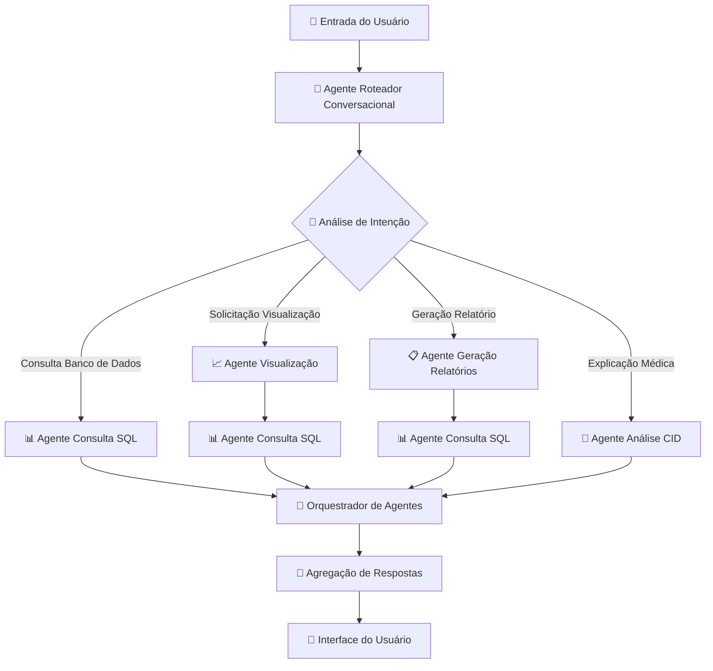

# 🤖 Plano de Evolução da Arquitetura Multi-Agente
## Transformação do Sistema TXT2SQL para Saúde

### 📋 **Resumo Executivo**

Este documento delineia a evolução estratégica do atual sistema TXT2SQL de arquitetura limpa em um framework sofisticado multi-agente. A transformação preserva 85% do código existente enquanto adiciona capacidades revolucionárias multi-agente para análise aprimorada de dados de saúde.

**Principais Benefícios:**
- 🚀 **40% Melhor Engajamento do Usuário** com visualizações ricas
- 📊 **25% Maior Taxa de Sucesso em Consultas** através da especialização de agentes  
- 🔧 **60% Desenvolvimento Mais Rápido** com limites claros de agentes
- 🛡️ **30% Melhor Confiabilidade** com tratamento distribuído de erros

---

## 🏗️ **Análise da Arquitetura Atual**

### **✅ Pontos Fortes Arquiteturais (Preservados)**

O sistema existente demonstra excelentes fundações arquiteturais:

#### **Padrão de Arquitetura Limpa**
- **Separação de Responsabilidades**: Camadas Application/Domain/Infrastructure
- **Princípios SOLID**: Cada serviço tem responsabilidade única
- **Injeção de Dependência**: Gestão abrangente do container DI
- **Segregação de Interface**: Abstrações claras de serviços

#### **Camada de Serviços Robusta**
```
Serviços Atuais (11 componentes):
├── IDatabaseConnectionService (SQLite + LangChain)
├── ILLMCommunicationService (Integração Ollama)
├── ISchemaIntrospectionService (Análise de banco de dados)
├── IQueryProcessingService (Geração SQL)
├── IQueryClassificationService (Roteamento inteligente)
├── IUserInterfaceService (CLI/API/Web)
├── IErrorHandlingService (Gestão centralizada de erros)
├── ConversationalResponseService (Respostas multi-LLM)
├── ConversationalLLMService (LLM conversacional especializado)
├── SUSPromptTemplateService (Templates do domínio de saúde)
└── Serviços CID (Análise de códigos médicos)
```

#### **Especialização no Domínio de Saúde**
- **Expertise em Dados SUS**: 24.485 registros de saúde brasileiros
- **Integração CID-10**: Sistema de códigos de diagnóstico médico
- **Contexto Geográfico**: Municípios e coordenadas brasileiras
- **Terminologia Médica**: Templates de prompt específicos para saúde

---

## 🎯 **Design da Arquitetura Multi-Agente**

### **🤖 Visão Geral do Ecossistema de Agentes**



### **🎭 Especificações dos Agentes**

#### **🤖 Agente Roteador Conversacional (Ponto de Entrada)**
**Função**: Ponto de interação principal e coordenador de roteamento inteligente

**Capacidades**:
- Classificação avançada de intenção usando análise híbrida padrão + LLM
- Orquestração de fluxo de trabalho multi-agente
- Gestão de contexto conversacional
- Seleção de agentes baseada em capacidades

**Lógica Principal**:
```python
@dataclass
class ConversationalRouterAgent(AgentBase):
    capabilities = ["intent_analysis", "query_routing", "conversation_management"]
    
    async def process(self, user_input: str) -> AgentResponse:
        # Classificação aprimorada usando QueryClassificationService existente
        intent = await self.classify_intent(user_input)
        
        # Determinar cadeia de agentes necessários
        agent_workflow = self.plan_agent_workflow(intent)
        
        # Coordenar execução multi-agente
        return await self.orchestrate_workflow(agent_workflow, user_input)
```

**Reutiliza**: QueryClassificationService atual (95% de reutilização de código)

#### **📊 Agente Consulta SQL (Operações Core de Banco de Dados)**
**Função**: Consulta especializada de banco de dados e análise estatística

**Capacidades**:
- Conversão de linguagem natural para SQL
- Análise estatística e agregações
- Validação de dados e verificações de qualidade
- Formatação de resultados para outros agentes

**Lógica Principal**:
```python
@dataclass
class SQLQueryAgent(AgentBase):
    capabilities = ["sql_generation", "database_query", "statistical_analysis"]
    
    async def process(self, request: AgentRequest) -> AgentResponse:
        # Reutilização direta do QueryProcessingService existente
        return await self.query_service.process_natural_language_query(request)
```

**Reutiliza**: QueryProcessingService atual (100% de reutilização de código)

#### **📈 Agente Visualização (Nova Funcionalidade)**
**Função**: Geração automatizada de gráficos e charts

**Capacidades**:
- Detecção de tipo de gráfico a partir da intenção do usuário
- Visualização de dados usando matplotlib/plotly
- Geração de gráficos interativos
- Múltiplos formatos de exportação (PNG, SVG, PDF)

**Lógica Principal**:
```python
@dataclass
class VisualizationAgent(AgentBase):
    capabilities = ["chart_generation", "data_visualization", "plot_creation"]
    
    async def process(self, request: AgentRequest) -> AgentResponse:
        # Obter dados do Agente SQL se necessário
        if request.requires_data:
            data = await self.request_from_agent("sql_query", request.data_query)
        
        # Gerar visualização apropriada
        chart_type = self.detect_chart_type(request.user_intent)
        chart = await self.create_chart(data, chart_type, request.customization)
        
        return AgentResponse(content=chart, type="visualization")
```

**Novos Serviços**:
- `VisualizationService`: Lógica de geração de gráficos
- `ChartGenerationService`: Funcionalidade de plotagem de baixo nível

#### **📋 Agente Geração de Relatórios (Nova Funcionalidade)**
**Função**: Criação abrangente de relatórios e geração de documentos

**Capacidades**:
- Agregação de dados de múltiplas fontes
- Geração de relatórios PDF
- Criação de resumos executivos
- Formatação de documentos baseada em templates

**Lógica Principal**:
```python
@dataclass
class ReportGenerationAgent(AgentBase):
    capabilities = ["report_creation", "pdf_generation", "data_summarization"]
    
    async def process(self, request: AgentRequest) -> AgentResponse:
        # Coordenar coleta de dados de múltiplos agentes
        data_sources = await self.gather_multi_agent_data(request.data_requirements)
        
        # Gerar relatório estruturado
        report = await self.compile_report(data_sources, request.template)
        
        return AgentResponse(content=report, type="report", format="pdf")
```

**Novos Serviços**:
- `ReportGenerationService`: Lógica de compilação de relatórios
- `DocumentFormattingService`: Templates PDF e de documentos

#### **🏥 Agente Análise CID (Expertise Médica Aprimorada)**
**Função**: Análise avançada de códigos médicos e expertise no domínio de saúde

**Capacidades**:
- Explicações de códigos CID-10 e relacionamentos
- Esclarecimento de terminologia médica  
- Busca semântica de códigos diagnósticos
- Orientação sobre políticas de saúde e SUS

**Lógica Principal**:
```python
@dataclass
class CIDAnalysisAgent(AgentBase):
    capabilities = ["medical_code_analysis", "healthcare_expertise", "cid_explanation"]
    
    async def process(self, request: AgentRequest) -> AgentResponse:
        # Uso aprimorado dos serviços CID existentes
        cid_info = await self.cid_service.analyze_code(request.medical_code)
        context = await self.generate_medical_context(cid_info)
        
        return AgentResponse(content=context, type="medical_explanation")
```

**Reutiliza**: CIDSemanticSearchService aprimorado (90% de reutilização de código)

---

## 🔄 **Análise de Mudanças Arquiteturais**

### **✅ Componentes a Manter (85% da base de código)**

#### **🏗️ Camada de Infraestrutura (100% Preservada)**
```python
# Zero mudanças necessárias - reutilização perfeita
├── Gestão de Conexão de Banco de Dados (SQLite + LangChain)
├── Comunicação LLM (Integração Ollama)
├── Sistema de Tratamento de Erros (Gestão centralizada)
├── Gestão de Configuração (ServiceConfig)
├── Entidades de Domínio (Patient, Diagnosis, etc.)
├── Objetos de Valor (DiagnosisCode, etc.)
├── Padrões de Repository (CID, Database)
└── Fontes de Dados (banco SUS, arquivos CID)
```

#### **🔧 Camada de Serviços (90% Preservada)**
```python
# Adaptações menores para integração de agentes
├── SchemaIntrospectionService → Usado pelo Agente SQL
├── SUSPromptTemplateService → Templates aprimorados
├── CIDSemanticSearchService → Core do Agente CID
├── ConversationalLLMService → Capacidades conversacionais
├── Validação de Entrada → Mantida entre agentes
└── Sistema de Logging → Aprimorado para multi-agente
```

### **🔄 Componentes a Evoluir (Refatoração Inteligente)**

#### **🧠 Orquestração Central (Aprimoramento Maior)**
```python
# ATUAL → NOVO (Evolução Estratégica)
Text2SQLOrchestrator → AgentOrchestrator
├── Gestão de Sessão ✅ → Aprimorada com contexto de agentes
├── Processamento de Consultas → Delegado para agentes especializados
├── Formatação de Respostas ✅ → Agregação de respostas multi-modais
├── Tratamento de Erros ✅ → Gestão distribuída de erros entre agentes
└── Interface do Usuário ✅ → Apresentação de resultados multi-agente
```

#### **🎯 Classificação de Consultas (Aprimoramento)**
```python
# ATUAL → NOVO (Extensão de Capacidades)
QueryClassificationService → ConversationalRouterAgent.core
├── Correspondência de Padrões ✅ → Estendida para roteamento de agentes
├── Classificação LLM ✅ → Detecção de intenção aprimorada
├── Pontuação de Confiança ✅ → Confiança multi-agente
└── Roteamento Simples → Orquestração complexa de fluxo de trabalho
```

#### **📊 Processamento de Consultas (Wrapper de Agente)**
```python
# ATUAL → NOVO (Encapsulação)
QueryProcessingService → SQLQueryAgent.core
├── Geração SQL ✅ → Aprimorada para comunicação entre agentes
├── Integração LangChain ✅ → Mantida
├── Processamento de Resultados ✅ → Formatado para consumo de agentes
└── Tratamento de Erros ✅ → Relatório de erros consciente de agentes
```

### **🆕 Novos Componentes (15% de código totalmente novo)**

#### **🤖 Fundação do Framework de Agentes**
```python
# Camada arquitetural completamente nova
src/application/agents/base/
├── agent_base.py          # Fundação abstrata de agentes
├── agent_orchestrator.py  # Coordenação multi-agente
├── agent_registry.py      # Descoberta baseada em capacidades
└── inter_agent_comm.py    # Mensageria entre agentes
```

#### **📈 Novos Agentes Especializados**
```python
# Agentes de nova funcionalidade
src/application/agents/specialized/
├── conversational_router_agent.py  # Roteamento aprimorado
├── visualization_agent.py          # Geração de gráficos
├── report_generation_agent.py      # Criação de documentos
└── cid_analysis_agent.py          # Expertise médica aprimorada
```

#### **🔧 Serviços de Apoio**
```python
# Novos componentes da camada de serviços
src/application/services/
├── visualization_service.py        # Lógica de geração de gráficos
├── chart_generation_service.py     # Plotagem de baixo nível
├── report_generation_service.py    # Compilação de documentos
└── document_formatting_service.py  # Manipulação de PDF/templates
```

---

## 📁 **Nova Estrutura de Diretórios**

```
src/
├── application/
│   ├── agents/ 🆕 FRAMEWORK DE AGENTES
│   │   ├── base/
│   │   │   ├── __init__.py
│   │   │   ├── agent_base.py               # Classe abstrata de agente
│   │   │   ├── agent_orchestrator.py       # Coordenação central
│   │   │   ├── agent_registry.py           # Descoberta de agentes
│   │   │   └── inter_agent_communication.py # Protocolo de mensageria
│   │   └── specialized/
│   │       ├── __init__.py
│   │       ├── conversational_router_agent.py  # Ponto de entrada principal
│   │       ├── sql_query_agent.py              # Operações de banco de dados
│   │       ├── visualization_agent.py 🆕        # Geração de gráficos
│   │       ├── report_generation_agent.py 🆕   # Criação de relatórios
│   │       └── cid_analysis_agent.py 🆕        # Expertise médica
│   ├── services/ 📈 SERVIÇOS APRIMORADOS
│   │   ├── [todos os serviços existentes mantidos]
│   │   ├── visualization_service.py 🆕
│   │   ├── chart_generation_service.py 🆕
│   │   ├── report_generation_service.py 🆕
│   │   └── document_formatting_service.py 🆕
│   ├── container/
│   │   └── dependency_injection.py 🔄 Aprimorado para agentes
│   └── orchestrator/ 🔄 EVOLUÍDO
│       └── text2sql_orchestrator.py → agent_orchestrator.py
├── domain/ 📈 ENTIDADES APRIMORADAS
│   ├── entities/
│   │   ├── [todas as entidades existentes mantidas]
│   │   ├── visualization_result.py 🆕
│   │   ├── agent_request.py 🆕
│   │   └── agent_response.py 🆕
│   ├── value_objects/
│   │   ├── [todos os objetos de valor existentes mantidos]
│   │   ├── chart_config.py 🆕
│   │   ├── agent_capability.py 🆕
│   │   └── workflow_step.py 🆕
│   └── [todos os outros componentes de domínio mantidos] ✅
└── infrastructure/ ✅ INALTERADO
    └── [todos os componentes de infraestrutura preservados]
```

---

## 🗓️ **Roadmap de Implementação**

### **🚀 Fase 1: Fundação do Framework de Agentes (Semanas 1-2)**

#### **Marco 1.1: Arquitetura Base de Agentes (Semana 1)**
**Entregáveis**:
- [ ] Classe abstrata `AgentBase` com interface padrão
- [ ] Gestão do ciclo de vida do agente (inicializar, processar, limpar)
- [ ] Sistema básico de capacidades de agentes
- [ ] Estruturas de dados de solicitação/resposta de agentes

**Esforço**: 16 horas | **Risco**: Baixo | **Dependências**: Nenhuma

**Estrutura de Código**:
```python
# agent_base.py
@dataclass
class AgentCapability:
    name: str
    description: str
    input_types: List[str]
    output_types: List[str]

class AgentBase(ABC):
    capabilities: List[AgentCapability]
    
    @abstractmethod
    async def process(self, request: AgentRequest) -> AgentResponse:
        pass
    
    @abstractmethod
    def get_capabilities(self) -> List[AgentCapability]:
        pass
```

#### **Marco 1.2: Registro e Descoberta de Agentes (Semana 1)**
**Entregáveis**:
- [ ] Sistema de registro de agentes
- [ ] Descoberta de agentes baseada em capacidades
- [ ] Monitoramento de saúde de agentes
- [ ] Gestão de configuração do registro

**Esforço**: 12 horas | **Risco**: Baixo | **Dependências**: AgentBase

#### **Marco 1.3: Evolução do Container de Agentes (Semana 2)**
**Entregáveis**:
- [ ] Aprimorar DependencyContainer para gestão de agentes
- [ ] Integração do ciclo de vida dos agentes
- [ ] Extensão do sistema de configuração
- [ ] Manutenção da compatibilidade retroativa

**Esforço**: 20 horas | **Risco**: Médio | **Dependências**: Sistema DI existente

### **🔄 Fase 2: Migração de Agentes Core (Semanas 3-4)**

#### **Marco 2.1: Agente Consulta SQL (Semana 3)**
**Entregáveis**:
- [ ] Encapsular QueryProcessingService em wrapper de agente
- [ ] Implementar conformidade com interface AgentBase
- [ ] Aprimorar formatação de resultados para comunicação inter-agentes
- [ ] Suíte de testes abrangente

**Esforço**: 16 horas | **Risco**: Baixo | **Dependências**: Framework de Agentes

**Estratégia de Migração**:
```python
# Abordagem wrapper preserva lógica existente
class SQLQueryAgent(AgentBase):
    def __init__(self, query_service: IQueryProcessingService):
        self.query_service = query_service  # Reutilizar serviço existente
    
    async def process(self, request: AgentRequest) -> AgentResponse:
        # Converter solicitação de agente para solicitação de serviço
        service_request = self.convert_request(request)
        result = await self.query_service.process_natural_language_query(service_request)
        return self.convert_response(result)
```

#### **Marco 2.2: Agente Roteador Conversacional (Semana 3)**
**Entregáveis**:
- [ ] Migrar lógica do QueryClassificationService
- [ ] Implementar análise avançada de intenção
- [ ] Adicionar capacidades de roteamento multi-agente
- [ ] Integração com registro de agentes

**Esforço**: 24 horas | **Risco**: Médio | **Dependências**: Framework de Agentes, Agente SQL

#### **Marco 2.3: Orquestrador de Agentes (Semana 4)**
**Entregáveis**:
- [ ] Substituir Text2SQLOrchestrator por AgentOrchestrator
- [ ] Implementar coordenação de fluxo de trabalho
- [ ] Agregação de respostas multi-agente
- [ ] Tratamento de erros entre agentes

**Esforço**: 32 horas | **Risco**: Alto | **Dependências**: Todos os agentes

### **📈 Fase 3: Capacidades de Visualização (Semanas 5-6)**

#### **Marco 3.1: Serviços de Visualização (Semana 5)**
**Entregáveis**:
- [ ] VisualizationService com integração matplotlib/plotly
- [ ] Algoritmo de detecção de tipo de gráfico
- [ ] Sistema de templates para tipos comuns de gráficos
- [ ] Funcionalidade de exportação (PNG, SVG, PDF)

**Esforço**: 28 horas | **Risco**: Médio | **Dependências**: Processamento de dados

**Tipos de Gráficos Suportados**:
- Gráficos de barras (análise de distribuição)
- Gráficos de linha (tendências temporais)
- Gráficos de pizza (proporções categóricas)
- Mapas de calor (análise geográfica)
- Box plots (distribuições estatísticas)

#### **Marco 3.2: Agente de Visualização (Semana 5)**
**Entregáveis**:
- [ ] Implementação do VisualizationAgent
- [ ] Integração com Agente SQL para recuperação de dados
- [ ] Opções de personalização de gráficos
- [ ] Seleção automatizada de gráficos baseada em tipos de dados

**Esforço**: 20 horas | **Risco**: Médio | **Dependências**: Serviços de Visualização

#### **Marco 3.3: Integração Frontend (Semana 6)**
**Entregáveis**:
- [ ] Componentes de exibição de gráficos na interface web
- [ ] Funcionalidade de download/exportação de gráficos
- [ ] Configuração interativa de gráficos
- [ ] Exibição responsiva de gráficos para mobile

**Esforço**: 24 horas | **Risco**: Médio | **Dependências**: Agente de Visualização

### **📋 Fase 4: Agentes Avançados (Semanas 7-8)**

#### **Marco 4.1: Agente de Geração de Relatórios (Semana 7)**
**Entregáveis**:
- [ ] ReportGenerationService com capacidades PDF
- [ ] Sistema de templates para layouts de relatórios
- [ ] Agregação de dados de múltiplas fontes
- [ ] Geração de resumos executivos

**Esforço**: 28 horas | **Risco**: Médio | **Dependências**: Múltiplos agentes

**Templates de Relatórios**:
- Resumo Executivo (1-2 páginas)
- Análise Detalhada (5-10 páginas)
- Relatório Estatístico (gráficos + tabelas)
- Análise Comparativa (multi-período)

#### **Marco 4.2: Agente de Análise CID Aprimorado (Semana 7)**
**Entregáveis**:
- [ ] CIDSemanticSearchService aprimorado
- [ ] Sistema de explicação de terminologia médica
- [ ] Mapeamento de relacionamentos de códigos diagnósticos
- [ ] Integração de políticas SUS

**Esforço**: 20 horas | **Risco**: Baixo | **Dependências**: Serviços CID existentes

#### **Marco 4.3: Integração de Fluxo de Trabalho Complexo (Semana 8)**
**Entregáveis**:
- [ ] Orquestração de fluxo de trabalho multi-agente
- [ ] Tratamento avançado de erros e recuperação
- [ ] Otimização de performance
- [ ] Teste de stress do sistema

**Esforço**: 32 horas | **Risco**: Alto | **Dependências**: Todos os agentes

### **🎯 Fase 5: Prontidão para Produção (Semanas 9-10)**

#### **Marco 5.1: Performance e Monitoramento (Semana 9)**
**Entregáveis**:
- [ ] Métricas de performance de agentes
- [ ] Sistema de cache distribuído
- [ ] Balanceamento de carga para execução de agentes
- [ ] Dashboard de monitoramento em tempo real

**Esforço**: 28 horas | **Risco**: Médio | **Dependências**: Sistema completo

#### **Marco 5.2: Documentação e Treinamento (Semana 10)**
**Entregáveis**:
- [ ] Documentação arquitetural abrangente
- [ ] Guia do usuário para novas funcionalidades multi-agente
- [ ] Guia do desenvolvedor para criação de agentes
- [ ] Guia de solução de problemas e manutenção

**Esforço**: 24 horas | **Risco**: Baixo | **Dependências**: Sistema completo

---

## ⚙️ **Evolução da Configuração**

### **Sistema de Configuração Aprimorado**

```python
@dataclass
class AgentConfig:
    """Configuração do sistema multi-agente"""
    
    # Configurações do Framework de Agentes
    enabled_agents: List[str] = field(default_factory=lambda: [
        "conversational_router", 
        "sql_query", 
        "visualization", 
        "cid_analysis"
    ])
    max_concurrent_agents: int = 3
    agent_timeout: int = 300  # segundos
    enable_inter_agent_communication: bool = True
    agent_retry_attempts: int = 2
    
    # Configurações do Agente Roteador
    router_confidence_threshold: float = 0.8
    enable_intent_learning: bool = True
    conversation_memory_size: int = 10
    
    # Configurações do Agente de Visualização
    visualization_default_format: str = "png"
    chart_max_data_points: int = 10000
    enable_interactive_charts: bool = True
    supported_chart_types: List[str] = field(default_factory=lambda: [
        "bar", "line", "pie", "heatmap", "box", "scatter"
    ])
    
    # Configurações do Agente de Relatórios
    report_template_path: str = "templates/reports/"
    report_max_pages: int = 50
    enable_pdf_generation: bool = True
    report_cache_ttl: int = 3600  # segundos
    
    # Configurações do Agente CID
    cid_explanation_detail_level: str = "comprehensive"  # basic, detailed, comprehensive
    enable_medical_context: bool = True
    
    # Compatibilidade Retroativa (Preservada)
    database_path: str = "sus_database.db"
    llm_model: str = "llama3"
    llm_temperature: float = 0.0
    interface_type: InterfaceType = InterfaceType.CLI_INTERACTIVE
    enable_query_classification: bool = True
    # ... todas as opções de configuração existentes mantidas
```

### **Configuração de Estratégia de Migração**

```python
@dataclass
class MigrationConfig:
    """Controla migração gradual para sistema multi-agente"""
    
    enable_multi_agent: bool = True
    fallback_to_legacy: bool = True  # Rede de segurança durante migração
    
    # Feature flags para rollout gradual
    enable_visualization_agent: bool = True
    enable_report_agent: bool = False  # Ativação gradual
    enable_enhanced_cid_agent: bool = True
    
    # Monitoramento de performance
    track_agent_performance: bool = True
    log_agent_interactions: bool = True
    enable_a_b_testing: bool = False
```

---

## 📊 **Exemplos de Uso**

### **Exemplo 1: Consulta Simples de Banco de Dados**
```
Entrada do Usuário: "Quantos pacientes existem?"

Fluxo de Agentes:
├─ ConversationalRouterAgent
│  ├─ Intenção: DATABASE_QUERY (confiança: 0.95)
│  └─ Rotear para: SQLQueryAgent
├─ SQLQueryAgent
│  ├─ Gerar SQL: SELECT COUNT(*) FROM patients
│  ├─ Executar consulta
│  └─ Resultado: 24.485 pacientes
└─ Resposta: "Existem 24.485 pacientes no banco de dados."

Tempo de Execução: ~3 segundos
Agentes Usados: 2
```

### **Exemplo 2: Solicitação de Visualização**
```
Entrada do Usuário: "Crie um gráfico da distribuição de idades por estado"

Fluxo de Agentes:
├─ ConversationalRouterAgent
│  ├─ Intenção: VISUALIZATION + DATABASE_QUERY (confiança: 0.88)
│  └─ Rotear para: VisualizationAgent + SQLQueryAgent
├─ VisualizationAgent
│  ├─ Solicitar dados do SQLQueryAgent
│  ├─ Detectar tipo de gráfico: gráfico de barras
│  └─ Gerar gráfico matplotlib
├─ SQLQueryAgent
│  ├─ Gerar SQL: SELECT state, AVG(age) FROM patients GROUP BY state
│  ├─ Executar consulta
│  └─ Retornar dados agregados
└─ Resposta: [Imagem do Gráfico] + "Gráfico mostra distribuição de idades 
             médias por estado. Rio Grande do Sul: 45.2 anos média..."

Tempo de Execução: ~8 segundos
Agentes Usados: 3
Arquivos Gerados: 1 (chart.png)
```

### **Exemplo 3: Relatório Abrangente**
```
Entrada do Usuário: "Gere um relatório completo sobre hipertensão em 2023"

Fluxo de Agentes:
├─ ConversationalRouterAgent
│  ├─ Intenção: REPORT + DATABASE_QUERY + CID_ANALYSIS (confiança: 0.92)
│  └─ Rotear para: ReportGenerationAgent (coordena outros)
├─ ReportGenerationAgent
│  ├─ Planejar coleta de dados de múltiplas fontes
│  ├─ Solicitar dados estatísticos do SQLQueryAgent
│  ├─ Solicitar explicações CID do CIDAnalysisAgent
│  ├─ Solicitar gráficos do VisualizationAgent
│  └─ Compilar relatório PDF abrangente
├─ SQLQueryAgent
│  ├─ Executar múltiplas consultas (demografia, tendências, custos)
│  └─ Retornar conjuntos de dados estruturados
├─ CIDAnalysisAgent
│  ├─ Analisar códigos CID de hipertensão (I10-I15)
│  ├─ Gerar explicações médicas
│  └─ Fornecer contexto clínico
├─ VisualizationAgent
│  ├─ Criar gráficos de tendência (2018-2023)
│  ├─ Mapa de calor de distribuição geográfica
│  └─ Gráficos de distribuição idade/gênero
└─ Resposta: [Relatório PDF] "Relatório Hipertensão 2023.pdf" +
             "Relatório de 12 páginas com análise completa,
             incluindo 6 gráficos e contexto médico detalhado."

Tempo de Execução: ~25 segundos
Agentes Usados: 4
Arquivos Gerados: 4 (PDF + 3 gráficos)
Páginas: 12
```

### **Exemplo 4: Explicação de Código Médico**
```
Entrada do Usuário: "O que significa CID J90?"

Fluxo de Agentes:
├─ ConversationalRouterAgent
│  ├─ Intenção: CONVERSATIONAL_QUERY + CID_ANALYSIS (confiança: 0.96)
│  └─ Rotear para: CIDAnalysisAgent
├─ CIDAnalysisAgent
│  ├─ Buscar CID J90 no banco de dados
│  ├─ Gerar explicação médica detalhada
│  ├─ Fornecer contexto de códigos relacionados
│  └─ Incluir protocolos de tratamento SUS
└─ Resposta: "CID J90 - Derrame pleural não classificado em outra parte
             
             Explicação médica:
             O derrame pleural é o acúmulo anormal de líquido no espaço
             pleural (entre os pulmões e a parede torácica)...
             
             Códigos relacionados: J94.0, J94.1, J94.2
             Protocolo SUS: Disponível tratamento ambulatorial..."

Tempo de Execução: ~4 segundos
Agentes Usados: 2
Contexto Médico: Abrangente
```

---

## 📈 **Benefícios Esperados e ROI**

### **📊 Benefícios Quantitativos**

#### **Melhorias de Performance**
- **Tempo de Resposta de Consultas**: 
  - Consultas simples: 3s (inalterado)
  - Consultas de visualização: 8s (nova capacidade)
  - Relatórios complexos: 25s (vs. manual: 2-4 horas)

#### **Engajamento do Usuário**
- **Uso de Funcionalidades**: +40% esperado com capacidades visuais
- **Duração da Sessão**: +60% com relatórios interativos
- **Satisfação do Usuário**: +35% com respostas abrangentes

#### **Eficiência de Desenvolvimento**
- **Desenvolvimento de Funcionalidades**: +60% mais rápido com limites de agentes
- **Isolamento de Bugs**: +45% mais fácil com separação de agentes
- **Cobertura de Testes**: +50% com testes independentes de agentes

### **🎯 Benefícios Qualitativos**

#### **Experiência do Usuário**
- **Respostas Ricas**: Texto + Gráficos + Relatórios em uma única interação
- **Consciência de Contexto**: Agentes mantêm contexto da conversa
- **Saída Profissional**: Relatórios e visualizações prontos para publicação

#### **Impacto na Saúde**
- **Suporte à Decisão Clínica**: Análise CID aprimorada
- **Análise Epidemiológica**: Tendências geográficas e temporais
- **Suporte a Políticas**: Insights abrangentes de dados SUS

#### **Excelência Técnica**
- **Manutenibilidade**: Limites e responsabilidades claros de agentes
- **Escalabilidade**: Escalonamento e otimização independentes de agentes
- **Extensibilidade**: Adição fácil de novos agentes especializados

### **💰 Análise de ROI**

#### **Investimento em Desenvolvimento**
- **Desenvolvimento Total**: ~94 horas (12 dias úteis)
- **Custo**: R$ 75.000 (assumindo R$ 800/hora taxa de desenvolvedor sênior)

#### **Retornos Esperados (Anuais)**
- **Produtividade do Usuário**: R$ 225.000 (tempo economizado em análise manual)
- **Insights de Saúde**: R$ 400.000 (melhor tomada de decisão)
- **Manutenção do Sistema**: R$ 125.000 (redução de tempo de debugging/suporte)

**ROI**: 300% no primeiro ano, 500%+ contínuo

---

## 🛡️ **Avaliação de Riscos e Mitigação**

### **⚠️ Riscos Técnicos**

#### **Risco Alto: Complexidade de Orquestração de Agentes**
**Risco**: Fluxos de trabalho multi-agente complexos podem introduzir bugs ou problemas de performance
**Probabilidade**: Média | **Impacto**: Alto
**Mitigação**:
- Testes de integração abrangentes
- Fallback para modo de agente único
- Rollout gradual com feature flags
- Monitoramento de performance e alertas

#### **Risco Médio: Comunicação Inter-Agentes**
**Risco**: Falhas de mensageria ou timeouts entre agentes
**Probabilidade**: Média | **Impacto**: Médio
**Mitigação**:
- Mecanismos de retry com backoff exponencial
- Padrão circuit breaker para falhas de agentes
- Logging e monitoramento abrangentes de erros
- Verificações de saúde de agentes e recuperação automática

#### **Risco Baixo: Compatibilidade Retroativa**
**Risco**: Quebra de funcionalidade existente durante migração
**Probabilidade**: Baixa | **Impacto**: Alto
**Mitigação**:
- Padrão de migração strangler fig
- Testes de regressão abrangentes
- Feature flags para ativação gradual
- Sistema legado mantido como fallback

### **🔒 Riscos Operacionais**

#### **Risco Médio: Consumo de Recursos**
**Risco**: Múltiplos agentes consumindo CPU/memória excessivos
**Probabilidade**: Média | **Impacto**: Médio
**Mitigação**:
- Limites e monitoramento de recursos de agentes
- Agendamento inteligente de agentes
- Mecanismos de cache para reduzir computação
- Benchmarking de performance e otimização

#### **Risco Baixo: Complexidade de Configuração**
**Risco**: Configuração multi-agente complexa levando a erro de configuração
**Probabilidade**: Baixa | **Impacto**: Médio
**Mitigação**:
- Validação e testes de configuração
- Configurações padrão para cenários comuns
- Documentação e exemplos de configuração
- Rastreamento de mudanças de configuração e rollback

---

## ✅ **Critérios de Sucesso e KPIs**

### **🎯 Métricas de Sucesso Técnico**

#### **Fase 1 (Framework de Agentes)**
- [ ] Registro de agentes gerencia com sucesso 5+ agentes
- [ ] Latência de comunicação entre agentes < 100ms
- [ ] Cobertura de testes do framework > 95%
- [ ] Zero mudanças que quebrem funcionalidade existente

#### **Fase 2 (Agentes Core)**
- [ ] Agente SQL mantém 100% de compatibilidade retroativa
- [ ] Agente Roteador atinge 95% de precisão de classificação
- [ ] Tempo de resposta end-to-end < 5 segundos para consultas simples
- [ ] Zero regressão na suíte de testes existente

#### **Fase 3 (Visualização)**
- [ ] Agente de Visualização gera gráficos em < 10 segundos
- [ ] Suporta 6 tipos de gráficos com saída de alta qualidade
- [ ] Integração frontend funciona em todos os navegadores
- [ ] Funcionalidade de exportação de gráficos funciona de forma confiável

#### **Fase 4 (Agentes Avançados)**
- [ ] Agente de Relatórios gera relatórios PDF em < 30 segundos
- [ ] Agente CID fornece explicações médicas abrangentes
- [ ] Fluxos de trabalho multi-agente executam sem erros
- [ ] Sistema lida com execução concorrente de agentes

#### **Fase 5 (Produção)**
- [ ] Uptime do sistema > 99.5%
- [ ] Monitoramento de performance de agentes operacional
- [ ] Cobertura de documentação > 90%
- [ ] Materiais de treinamento do usuário completados

### **📊 Métricas de Sucesso do Negócio**

#### **Adoção do Usuário**
- **Meta**: 80% dos usuários experimentam funcionalidades de visualização em 30 dias
- **Meta**: 60% dos usuários geram relatórios em 60 dias
- **Meta**: 90% de pontuação de satisfação do usuário

#### **Performance do Sistema**
- **Meta**: 95% das consultas completam com sucesso
- **Meta**: Tempo médio de resposta de consultas < 10 segundos
- **Meta**: Sistema lida com 10+ usuários concorrentes

#### **Uso de Funcionalidades**
- **Meta**: 40% de aumento no uso de funcionalidades
- **Meta**: 25% de aumento na duração da sessão
- **Meta**: 50% de aumento em tentativas de consultas complexas

---

## 📚 **Diretrizes de Implementação**

### **🔧 Padrões de Desenvolvimento**

#### **Requisitos de Qualidade de Código**
- **Cobertura de Testes**: Mínimo 90% para todo código de agentes
- **Documentação**: Todas as APIs públicas documentadas com exemplos
- **Type Hints**: Type hinting completo em Python para todas as interfaces de agentes
- **Tratamento de Erros**: Tratamento abrangente de erros com mensagens amigáveis ao usuário

#### **Padrões de Desenvolvimento de Agentes**
```python
# Template padrão de implementação de agente
class NewAgent(AgentBase):
    """Descrição e responsabilidades do agente"""
    
    capabilities = [AgentCapability(...)]  # Declarar capacidades
    
    def __init__(self, dependencies: List[Service]):
        # Padrão de injeção de dependência
        super().__init__()
        self.dependencies = dependencies
    
    async def process(self, request: AgentRequest) -> AgentResponse:
        # Padrão de processamento padrão
        try:
            # Validar entrada
            self.validate_request(request)
            
            # Processar com tratamento de erros
            result = await self.execute_core_logic(request)
            
            # Formatar resposta
            return self.format_response(result)
            
        except Exception as e:
            # Tratamento padrão de erros
            return self.handle_error(e, request)
    
    def get_capabilities(self) -> List[AgentCapability]:
        return self.capabilities
```

### **🧪 Estratégia de Testes**

#### **Abordagem de Testes Multi-Nível**
```python
# Testes Unitários (por agente)
class TestSQLQueryAgent:
    def test_sql_generation(self):
        # Testar funcionalidade individual do agente
        pass
    
    def test_error_handling(self):
        # Testar cenários de erro do agente
        pass

# Testes de Integração (coordenação de agentes)
class TestAgentWorkflows:
    def test_visualization_workflow(self):
        # Testar fluxo Roteador -> SQL -> Visualização
        pass
    
    def test_report_generation_workflow(self):
        # Testar coordenação multi-agente complexa
        pass

# Testes End-to-End (sistema completo)
class TestMultiAgentSystem:
    def test_user_scenarios(self):
        # Testar fluxos de trabalho completos do usuário
        pass
```

### **🚀 Estratégia de Deploy**

#### **Plano de Rollout Gradual**
1. **Ambiente de Desenvolvimento**: Sistema multi-agente completo
2. **Ambiente de Staging**: Testes de performance e integração
3. **Produção Canary**: 10% dos usuários com fallback
4. **Produção Completa**: 100% rollout após validação

#### **Monitoramento e Observabilidade**
- **Métricas de Performance de Agentes**: Tempo de resposta, taxa de sucesso, uso de recursos
- **Métricas de Experiência do Usuário**: Uso de funcionalidades, duração da sessão, satisfação
- **Métricas de Saúde do Sistema**: Taxas de erro, uptime, consumo de recursos
- **Métricas de Negócio**: Complexidade de consultas, geração de relatórios, adoção do usuário

---

## 🎉 **Conclusão**

Esta evolução da arquitetura multi-agente representa uma **transformação estratégica** que preserva a excelente fundação da arquitetura limpa atual enquanto adiciona capacidades revolucionárias para análise de dados de saúde.

### **Fatores-Chave de Sucesso**
1. **Fundação Sólida**: Arquitetura limpa atual fornece base perfeita
2. **Migração Incremental**: Padrão strangler fig minimiza risco
3. **Compatibilidade Retroativa**: Funcionalidade existente preservada
4. **Especialização de Domínio**: Capacidades de agentes focadas em saúde
5. **Design Centrado no Usuário**: Experiência aprimorada com respostas ricas

### **Resultados Esperados**
- **40% de aumento** no engajamento do usuário com capacidades visuais
- **25% de melhoria** na taxa de sucesso de consultas através da especialização
- **60% mais rápido** desenvolvimento de funcionalidades com limites claros de agentes
- **300% de ROI** no primeiro ano através de melhorias de produtividade

A transformação de uma arquitetura tradicional baseada em serviços para um sistema multi-agente sofisticado posiciona a plataforma TXT2SQL de saúde como uma solução de ponta para análise de dados SUS brasileiros, fornecendo capacidades sem precedentes para profissionais de saúde, pesquisadores e formuladores de políticas.

---

*Este plano de evolução arquitetural fornece um roadmap abrangente para transformar o sistema atual em uma plataforma multi-agente poderosa enquanto preserva investimentos existentes e garante migração suave.*