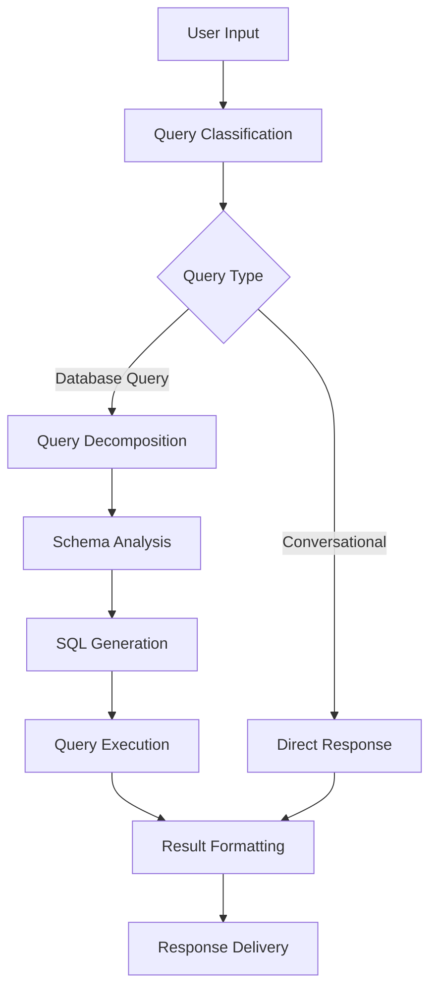

# 🏥 TXT2SQL - Healthcare AI System


> **Natural Language to SQL converter for Brazilian Healthcare Data (SUS)**
> 
>AI system that transforms natural language questions into SQL queries, specifically designed for Brazilian healthcare data analysis. Built with clean architecture principles and featuring intelligent query routing, decomposition, and multi-interface support.

## 📋 Table of Contents

- [🎯 Quick Start](#-quick-start)
- [✨ Features](#-features)
- [🏗️ Architecture](#️-architecture)
- [📦 Installation](#-installation)
- [🚀 Usage](#-usage)
- [🔌 API Reference](#-api-reference)
- [🌐 Web Interface](#-web-interface)
- [📊 Evaluation & Performance](#-evaluation--performance)
- [🔧 Configuration](#-configuration)
- [🐛 Troubleshooting](#-troubleshooting)

---

## 🎯 Quick Start

Get up and running in 5 minutes:

```bash
# 1. Install dependencies
pip install -r requirements.txt

# 2. Set up database
python database_setup.py

# 3. Start Ollama service
ollama serve

# 4. Install LLM model
ollama pull llama3          # Primary model
ollama pull mistral         # Alternative model

# 5. Start the frontend
cd frontend
npm run dev
```

**First query example:**
```
💬 Pergunta: Quantos pacientes existem?
🔍 Resposta: Existem 24,485 pacientes no banco de dados.
```

---

## ✨ Features

### 🧠 **Intelligent Query Processing**
- **Smart Query Routing**: Automatically classifies queries as database or conversational
- **Query Decomposition**: Breaks down complex queries into manageable components
- **Fallback Mechanisms**: Robust error handling with graceful degradation
- **Multi-LLM Support**: Primary and fallback LLM models for reliability

### 🏥 **Healthcare Domain Specialization**
- **SUS Data Integration**: 24,485+ Brazilian healthcare records
- **CID-10 Semantic Search**: Diagnostic code lookup and validation
- **Geographic Analysis**: Brazilian cities and regions support
- **Medical Terminology**: Healthcare-specific prompts and validation

### 🔧 **Clean Architecture Implementation**
- **SOLID Principles**: Single Responsibility, Open/Closed, Liskov Substitution, Interface Segregation, Dependency Inversion
- **Dependency Injection**: Modular, testable components
- **Service-Oriented Design**: 10+ specialized services
- **Enterprise Patterns**: Repository, Factory, Service Layer patterns

### 🖥️ **Multi-Interface Support**
- **CLI Interface**: Interactive and basic modes
- **REST API**: FastAPI with automatic documentation
- **Web Interface**: Modern web UI with real-time processing
- **Programmatic Access**: Python SDK for integration

### 📊 **Advanced Analytics**
- **Performance Benchmarking**: Model evaluation and comparison
- **Query Analysis**: Complexity scoring and pattern recognition
- **Statistical Reporting**: Comprehensive analytics dashboard
- **Error Tracking**: Detailed logging and monitoring

---

## 🏗️ Architecture

### System Overview

```
┌─────────────────────────────────────────────────────────────────┐
│                    TXT2SQL System                        │
├─────────────────────────────────────────────────────────────────┤
│  CLI Interface  │  REST API  │  Web Interface  │  Python SDK    │
├─────────────────────────────────────────────────────────────────┤
│                Text2SQL Orchestrator                            │
├─────────────────────────────────────────────────────────────────┤
│ Query Classification │ Query Decomposition │ Response Generation │
├─────────────────────────────────────────────────────────────────┤
│    Database Route    │                │    Conversational Route │
├─────────────────────────────────────────────────────────────────┤
│  Schema Introspection │  LLM Communication  │  SUS Domain Service │
├─────────────────────────────────────────────────────────────────┤
│           SQLite Database (SUS Data) │ Ollama LLM Models        │
└─────────────────────────────────────────────────────────────────┘
```

### Core Components

#### **Application Layer** (`src/application/`)
- **Text2SQL Orchestrator**: Main coordinator with intelligent routing
- **Dependency Container**: Manages service lifecycles and dependencies
- **10 Specialized Services**: Each following Single Responsibility Principle

#### **Domain Layer** (`src/domain/`)
- **Entities**: Core business objects (Patient, Diagnosis, QueryResult)
- **Value Objects**: Immutable data structures
- **Domain Services**: Business logic encapsulation
- **Repository Interfaces**: Data access abstractions

#### **Infrastructure Layer** (`src/infrastructure/`)
- **Database Repositories**: SQLite implementations
- **External Services**: Ollama LLM integration
- **Configuration Management**: Environment and settings

### Query Processing Flow



---

## 📦 Installation

### Prerequisites

- **Python 3.8+** (recommended: 3.10+)
- **Ollama** (for LLM models)
- **Node.js 16+** (for web interface)
- **SQLite** (included with Python)

### Step-by-Step Installation

#### 1. **Clone Repository**
```bash
git clone https://github.com/MaiconKevyn/agent_llama3_txt2sql.git
cd agent_llama3_txt2sql
```

#### 2. **Python Environment Setup**
```bash
# Create virtual environment
python -m venv venv

# Activate virtual environment
# On Linux/Mac:
source venv/bin/activate
# On Windows:
venv\Scripts\activate

# Install dependencies
pip install -r requirements.txt
```

#### 3. **Database Setup**
```bash
# Initialize SUS database with 24,485 records
python database_setup.py

# Verify database creation
ls -la sus_database.db
```

#### 4. **Ollama Installation**
```bash
# Install Ollama (Linux/Mac)
curl -fsSL https://ollama.ai/install.sh | sh

# Start Ollama service
ollama serve

# Install LLM models
ollama pull llama3          # Primary model
ollama pull llama3.2        # Conversational model
ollama pull mistral         # Alternative model
```

#### 5. **Web Interface Setup** (Optional)
```bash
# Navigate to frontend directory
cd frontend

# Install Node.js dependencies
npm install

# Return to project root
cd ..
```

#### 6. **Verification**
```bash
# Test system health
python txt2sql_agent_clean.py --health-check

# Test single query
python txt2sql_agent_clean.py --query "Quantos pacientes existem?"
```

---

## 🚀 Usage

### Frontend Interface

#### **Start Frontend** (Recommended)
```bash
cd frontend
npm run dev
```

Features:
- 🎨 Modern web interface
- 📱 Mobile-friendly design
- 🔍 Real-time query processing
- 📊 Visual result presentation
- 🎯 Query routing indicators

#### **Alternative: Command Line Interface**
```bash
python txt2sql_agent_clean.py
```

#### **Single Query Mode**
```bash
python txt2sql_agent_clean.py --query "Quantas mortes em Porto Alegre?"
```

#### **System Information**
```bash
# Architecture information
python txt2sql_agent_clean.py --version

# Health check
python txt2sql_agent_clean.py --health-check
```

### Query Examples

#### **Statistical Queries** (Database Route)
```bash
# Count queries
"Quantos pacientes existem?"
"Quantas mortes foram registradas?"

# Aggregation queries
"Qual a idade média dos pacientes?"
"Qual o custo total por estado?"

# Geographic queries
"Quantas mortes ocorreram em Porto Alegre?"
"Quais estados têm mais casos?"

# Complex analysis
"Qual a correlação entre idade e custo de procedimentos?"
```

#### **Conversational Queries** (Direct Response)
```bash
# CID-10 explanations
"O que significa CID J90?"
"Explique o diagnóstico I10"

# Medical concepts
"O que é hipertensão arterial?"
"Quais são os sintomas de diabetes?"

# SUS information
"Para que serve o SUS?"
"Como funciona o sistema de saúde brasileiro?"
```

---

## 🔌 API Reference

### **Start API Server**
```bash
# Development server
python api_server.py

# Production server
uvicorn api_server:app --host 0.0.0.0 --port 8000
```

### **Endpoints**

#### **POST /query**
Process natural language query and return SQL results or conversational response.

**Request:**
```json
{
  "question": "Quantos pacientes existem?",
  "options": {
    "enable_decomposition": true,
    "complexity_threshold": 2,
    "debug_mode": false
  }
}
```

**Response:**
```json
{
  "question": "Quantos pacientes existem?",
  "sql_query": "SELECT COUNT(*) FROM pacientes",
  "result": [{"count": 24485}],
  "metadata": {
    "query_type": "DATABASE_QUERY",
    "classification_confidence": 0.95,
    "execution_time": 1.23,
    "decomposition_applied": false,
    "complexity_score": 1
  }
}
```

#### **GET /health**
System health check endpoint.

**Response:**
```json
{
  "status": "healthy",
  "database_connection": "ok",
  "llm_models": ["llama3", "llama3.2"],
  "services": {
    "query_classification": "ok",
    "decomposition": "ok",
    "schema_introspection": "ok"
  }
}
```

#### **GET /models**
List available LLM models.

**Response:**
```json
{
  "primary_model": "llama3",
  "conversational_model": "llama3.2",
  "available_models": ["llama3", "llama3.2", "mistral"],
  "model_status": "online"
}
```

### **API Client Example**

```python
import requests

# Query execution
response = requests.post('http://localhost:8000/query', json={
    "question": "Quantos pacientes têm mais de 60 anos?",
    "options": {"enable_decomposition": True}
})

result = response.json()
print(f"SQL: {result['sql_query']}")
print(f"Result: {result['result']}")
```

---

## 🌐 Web Interface

### **Start Web Interface**
```bash
# Start API server (Terminal 1)
python api_server.py

# Start web server (Terminal 2)
cd frontend
npm run dev
```

### **Access Application**
- **Web Interface**: http://localhost:3000
- **API Documentation**: http://localhost:8000/docs
- **Health Check**: http://localhost:8000/health

### **Web Features**
- 🎨 Modern, responsive design
- 📱 Mobile-friendly interface
- 🔍 Real-time query processing
- 📊 Visual result presentation
- 🎯 Query routing indicators
- 🧩 Decomposition status display
- 📈 Performance metrics
- 🔄 Query history

---

## 📊 Evaluation & Performance

### **Benchmarking System**

The project includes a comprehensive evaluation system for comparing different LLM models:

```bash
# Run complete evaluation
cd evaluation

# 1. Execute models
python model_runner.py --all-models --output-dir results

# 2. Evaluate queries
python query_evaluator.py --input results/model_results_TIMESTAMP.json

# 3. Generate analysis
python analysis_reporter.py --input results/evaluation_results_TIMESTAMP.json
```

### **Performance Metrics**

#### **Query Processing Times**
- **Simple queries**: 2-5 seconds
- **Conversational queries**: 3-7 seconds
- **Complex queries (with decomposition)**: 8-15 seconds
- **Database queries**: 15-30 seconds

#### **Model Performance** (Latest Benchmarks)
| Model | Exact Match | Semantic Equivalence | SQL Similarity | Success Rate |
|-------|-------------|---------------------|----------------|--------------|
| Qwen 3 | 33.3% | 66.7% | 0.720 | 93.3% |
| Ollama Llama3 | 33.3% | 53.3% | 0.681 | 86.7% |
| Mistral | 20.0% | 46.7% | 0.650 | 80.0% |

**Note**: Both Llama3 and Mistral are supported as primary models. Llama3 is recommended for better performance, while Mistral serves as a reliable alternative.

#### **System Capabilities**
- **Database Records**: 24,485 SUS patient records
- **Query Classification Accuracy**: 95%+
- **Decomposition Success Rate**: 100% (with fallback)
- **Supported Query Types**: 50+ patterns
- **Response Time**: < 30s for 99% of queries

### **Quality Metrics**
- **Exact Match Rate**: Identical results to ground truth
- **Semantic Equivalence**: Logically correct results
- **SQL Similarity**: Syntactic similarity using Jaccard index
- **Execution Success**: Queries that execute without errors

---

## 🔧 Configuration

### **Environment Variables**

Create a `.env` file in the project root:

```env
# LLM Configuration
LLM_MODEL=llama3                    # Primary model (or use mistral)
CONVERSATIONAL_MODEL=llama3.2       # Conversational model
LLM_TIMEOUT=120
OLLAMA_URL=http://localhost:11434

# Database Configuration
DATABASE_PATH=sus_database.db
ENABLE_QUERY_LOGGING=true

# Query Processing
ENABLE_QUERY_ROUTING=true
ENABLE_QUERY_DECOMPOSITION=true
DECOMPOSITION_COMPLEXITY_THRESHOLD=2
DECOMPOSITION_DEBUG_MODE=false

# API Configuration
API_HOST=0.0.0.0
API_PORT=8000
ENABLE_CORS=true
API_RATE_LIMIT=100

# Web Interface
WEB_PORT=3000
WEB_HOST=localhost
```

### **Service Configuration**

Advanced configuration through `src/application/config/simple_config.py`:

```python
@dataclass
class ServiceConfig:
    # Database settings
    database_path: str = "sus_database.db"
    connection_timeout: int = 30
    
    # LLM settings
    llm_model: str = "llama3"           # Primary model (or "mistral")
    llm_timeout: int = 120
    retry_attempts: int = 3
    
    # Query processing
    enable_query_routing: bool = True
    enable_decomposition: bool = True
    complexity_threshold: int = 2
    
    # Interface settings
    interface_type: InterfaceType = InterfaceType.CLI_INTERACTIVE
    enable_logging: bool = True
```

---

## 🐛 Troubleshooting

### **Common Issues**

#### **1. Ollama Connection Failed**
```bash
# Check Ollama service
ollama list

# Start Ollama if not running
ollama serve

# Test connection
curl http://localhost:11434/api/version
```

#### **2. Database Not Found**
```bash
# Reinitialize database
python database_setup.py

# Check database file
ls -la sus_database.db
```

#### **3. Model Not Found**
```bash
# List available models
ollama list

# Install missing model
ollama pull llama3
```

#### **4. Port Already in Use**
```bash
# Find process using port
lsof -i :8000

# Kill process
kill -9 <PID>

# Or use different port
python api_server.py --port 8001
```

### **Debug Mode**

Enable debug mode for detailed logging:

```bash
# CLI with debug
python txt2sql_agent_clean.py --debug

# API with debug
DECOMPOSITION_DEBUG_MODE=true python api_server.py
```

### **Health Check**

```bash
# System health check
python txt2sql_agent_clean.py --health-check

# API health check
curl http://localhost:8000/health
```

### **Log Files**

Check logs for detailed error information:
- `txt2sql_errors.log` - Main application logs
- `tests/txt2sql_errors.log` - Test execution logs

---


### **Adding New Features**

1. **New Services**: Follow the service pattern in `src/application/services/`
2. **New Models**: Add to the evaluation system in `evaluation/`
3. **New Interfaces**: Implement in `src/application/services/user_interface_service.py`
4. **New Tests**: Add to `tests/` directory

### **Architecture Guidelines**

- **Single Responsibility**: Each service has one clear purpose
- **Dependency Injection**: Use the DI container for all dependencies
- **Interface Segregation**: Define clear interfaces for services
- **Error Handling**: Use the centralized error handling service
- **Testing**: Write unit tests for all new components

---


---

<div align="center">
<strong>Built with ❤️ for Brazilian Healthcare Data Analysis</strong>
<br>
<sub>Transforming healthcare data accessibility through AI</sub>
</div>