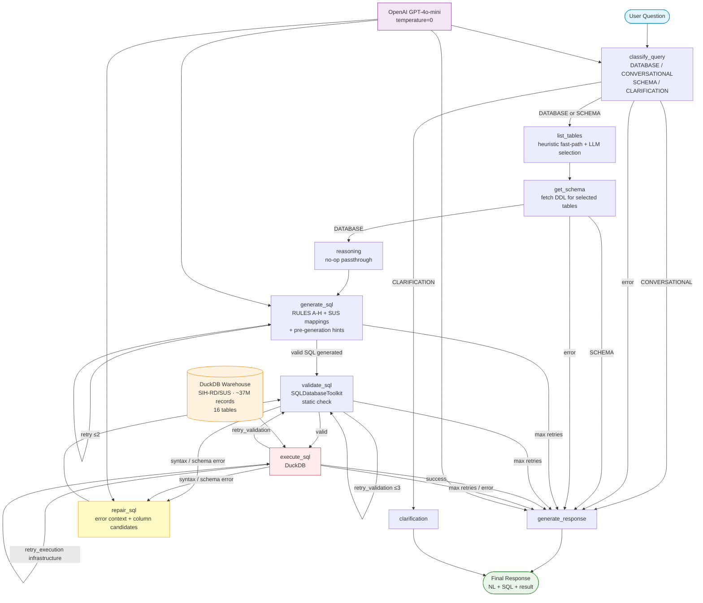

# TXT2SQL — DataVisSUS (GPT-4o-mini + LangGraph)

## Overview

TXT2SQL is a Portuguese natural-language to SQL agent for Brazilian healthcare microdata (DATASUS SIH-RD/SUS). It translates Portuguese questions into executable SQL over a DuckDB warehouse (~37M hospital records, 16 tables) using a stateful LangGraph pipeline and OpenAI GPT-4o-mini. No model fine-tuning is required.

**Key capabilities:**
- Natural-language query processing in Portuguese
- Query classification: DATABASE, CONVERSATIONAL, SCHEMA, CLARIFICATION routes
- Heuristic + LLM-based table selection with keyword fast-path (confidence ≥ 0.85 skips LLM)
- Eight domain-specific SQL generation rules (RULES A–H) for SUS-coded values
- Static SQL validation via LangChain's SQLDatabaseToolkit before execution
- Bounded self-repair loop: up to 2 generation retries, 3 validation retries, 15-step global cap
- Loop-detection guard (terminates if two consecutive repair attempts produce identical SQL)
- Multi-turn conversation state across dialogue turns
- Multi-interface: CLI, REST API, web frontend
- Structured logging, SQL injection prevention, session management

**Target use cases:** Healthcare data analysis, medical research queries, hospital administration insights, public health data exploration.

---

## Agent Workflow

The pipeline has 9 nodes. All queries enter through `classify_query`; only DATABASE queries traverse the full SQL path.



**Node responsibilities:**

| Node | Role |
|---|---|
| `classify_query` | Routes query type; heuristic fast-path for clear DATABASE queries |
| `list_tables` | Lists available tables; keyword-regex fast-path (conf ≥ 0.85) then LLM selection |
| `get_schema` | Fetches DDL (columns, types, FK) for selected tables |
| `reasoning` | No-op passthrough; reserved for future pre-generation planning |
| `generate_sql` | Generates SQL with RULES A–H, SUS value mappings, per-table few-shot examples, and pre-generation hints |
| `validate_sql` | Static check via LangChain's SQLDatabaseToolkit; column whitelist + similarity scoring |
| `execute_sql` | Runs query against DuckDB; routes based on error type |
| `repair_sql` | Rebuilds SQL prompt with error context, column candidates, and similarity-ranked substitutions |
| `generate_response` | Formats final NL response; also handles all error exits |
| `clarification` | Returns a clarification prompt for ambiguous or unanswerable queries |

---

## Setup

### Prerequisites

- Python 3.11+
- OpenAI API key (`OPENAI_API_KEY`)
- DuckDB file with SIH-RD/SUS schema (path in `.env`)
- Git
- Node.js 18+ (optional, for web interface)

### Installation

```bash
git clone https://github.com/MaiconKevyn/txt2sql_refactor_openai.git
cd txt2sql_refactor_openai

python -m venv .venv
source .venv/bin/activate   # Linux/macOS
# .venv\Scripts\activate    # Windows

pip install -r requirements.txt
```

### Environment Configuration

```bash
cp .env.example .env
```

Required variables in `.env`:

```env
OPENAI_API_KEY=sk-...

# DuckDB (default)
DATABASE_PATH=duckdb:////absolute/path/to/sihrd5.duckdb?access_mode=read_only

# LangSmith tracing (optional)
LANGSMITH_TRACING=false
LANGSMITH_API_KEY=
```

### Web Interface (optional)

```bash
cd frontend
npm install
npm run dev
# Access at http://localhost:3000
```

---

## Usage

### CLI

```bash
# Single query
python src/interfaces/cli/agent.py --query "Quantas mortes ocorreram em 2022?"

# Interactive session
python src/interfaces/cli/agent.py

# Debug mode (step-by-step workflow trace)
python src/interfaces/cli/agent.py --query "Quantos hospitais existem?" --debug-steps

# Health check
python src/interfaces/cli/agent.py --health-check

# Override database path
python src/interfaces/cli/agent.py --db-url "duckdb:////path/to/db.duckdb?access_mode=read_only" --query "..."
```

### API Server

```bash
python src/interfaces/api/main.py
# Docs at http://localhost:8000/docs
```

---

## Evaluation

Both the LangGraph agent and a single-shot rich-prompt baseline are evaluated on the same 81 Portuguese healthcare queries (31 Easy / 29 Medium / 21 Hard) with the same model (GPT-4o-mini, temperature=0) and identical prompts. The baseline uses no LangGraph orchestration, isolating the net architectural contribution.

### Metrics

| Metric | Description |
|---|---|
| **EX** — Execution Accuracy | Query correct if result set matches gold standard (primary metric) |
| **CM** — Component Matching | Clause-level structural similarity |
| **EM** — Exact Match | Syntactic match to gold SQL |

### Latest Results (2026-02-26)

| System | EX | CM | EM | Latency |
|---|---|---|---|---|
| LangGraph Agent | **96.3%** (78/81) | 80.8% | 23.5% | ~8.0 s/query |
| Rich Prompt Baseline | 88.9% (72/81) | 75.8% | 16.0% | ~5.2 s/query |
| Δ (Agent − Baseline) | **+7.4 pp** | +5.0 pp | +7.5 pp | +2.8 s |

Completion rate: 100% for both systems (all 81 queries returned a response without pipeline crash).

Statistical comparison: exact McNemar's test, $b=7$, $c=1$, $p=0.070$ (marginal; limited power on 81 queries). Wilson 95% CI: agent [89.7%, 98.7%], baseline [80.2%, 94.0%].

### Running Evaluation

```bash
# LangGraph agent
python evaluation/run_dag_evaluation.py

# Single-shot baseline
python evaluation/run_rich_prompt_baseline.py
```

Results are written to `evaluation/results/` (agent) and `baselines/rich_prompt_baseline/artifacts/` (baseline).

---

## Key Files

```
src/agent/
├── nodes.py          # All 9 node implementations; RULES A–H (~line 695);
│                     # heuristic table selection (~line 1808);
│                     # _enhance_sus_schema_context (~line 1681)
├── workflow.py       # LangGraph graph definition and all routing functions
├── state.py          # MessagesStateTXT2SQL, retry logic, phase tracking
└── llm_manager.py    # ChatOpenAI setup (reads OPENAI_API_KEY)

src/application/config/
├── table_templates.py    # Per-table few-shot examples and generation rules
└── table_descriptions.py # TABLE_DESCRIPTIONS dict used in table selection

evaluation/
├── ground_truth.json          # 81 test queries (GT001–GT081)
├── run_dag_evaluation.py      # Agent evaluation entrypoint
└── run_rich_prompt_baseline.py

baselines/rich_prompt_baseline/  # Single-shot baseline implementation
```

---

## Tests

```bash
# Run all tests
python -m pytest tests/ -v

# With coverage
python -m pytest tests/ --cov=src --cov-report=html
```

Test suite covers SQL injection prevention (`test_sql_safety.py`) and execution blocking at workflow and manager levels (`test_sql_execution_block.py`). All 16 tests passing.

---

## Logs

```bash
tail -f logs/txt2sql_orchestrator.log  # Main orchestration
tail -f logs/txt2sql_nodes.log         # Workflow node execution
tail -f logs/txt2sql_llm_manager.log   # LLM calls
tail -f logs/txt2sql_api.log           # API requests
```
