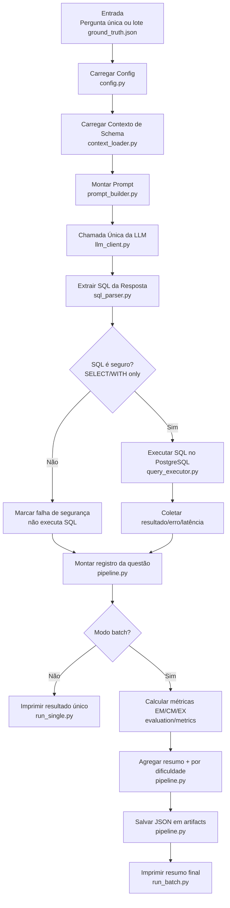

# Fluxo da Baseline LLM Direta (Sem LangGraph)

Este documento descreve o fluxo da baseline implementada em `baselines/llm_direct_sql/`, usada para comparação com o agente principal.

## Diagrama Mermaid

## Etapas do Fluxo

1. **Entrada**
   - Pode ser pergunta única (`run_single.py`) ou lote (`run_batch.py` com `evaluation/ground_truth.json`).

2. **Configuração**
   - `config.py` lê provider/model/timeout/DB URL e parâmetros de execução.
   - Suporta env vars e override por CLI.

3. **Contexto de tabelas**
   - `context_loader.py` monta contexto textual com base em `TABLE_DESCRIPTIONS`.
   - Inclui descrição, colunas-chave, notas críticas e relacionamentos.

4. **Prompt**
   - `prompt_builder.py` cria:
     - `system prompt` com regras SQL (read-only, usar schema real, evitar tabelas antigas).
     - `user prompt` com pergunta + contexto.

5. **Geração SQL (LLM pura)**
   - `llm_client.py` faz **uma chamada direta** à LLM.
   - Não usa LangGraph, tools, planner, nem retry automático.

6. **Parsing e validação de segurança**
   - `sql_parser.py` extrai SQL da resposta (com ou sem markdown).
   - Usa `src/utils/sql_safety.py` para validar `SELECT`/`WITH ... SELECT`.
   - Se não for seguro, bloqueia execução.

7. **Execução no banco**
   - `query_executor.py` executa SQL no Postgres com `statement_timeout`.
   - Retorna linhas, colunas, latência e mensagem de erro quando houver.

8. **Registro de resultado por pergunta**
   - `pipeline.py` consolida:
     - pergunta, SQL previsto, segurança, erro, latência.
     - metadados da LLM.

9. **Métricas (batch)**
   - `pipeline.py` integra com `evaluation/metrics`:
     - EM (Exact Match)
     - CM (Component Matching)
     - EX (Execution Accuracy)

10. **Agregação e saída**
    - `pipeline.py` gera resumo global e por dificuldade.
    - Salva JSON em `baselines/llm_direct_sql/artifacts/`.
    - `run_batch.py` imprime o resumo final no terminal.

## Mapeamento rápido de arquivos

- Runner single: `baselines/llm_direct_sql/run_single.py`
- Runner batch: `baselines/llm_direct_sql/run_batch.py`
- Orquestração: `baselines/llm_direct_sql/pipeline.py`
- Config: `baselines/llm_direct_sql/config.py`
- Contexto: `baselines/llm_direct_sql/context_loader.py`
- Prompt: `baselines/llm_direct_sql/prompt_builder.py`
- Cliente LLM: `baselines/llm_direct_sql/llm_client.py`
- Parsing/segurança SQL: `baselines/llm_direct_sql/sql_parser.py`
- Executor SQL: `baselines/llm_direct_sql/query_executor.py`

